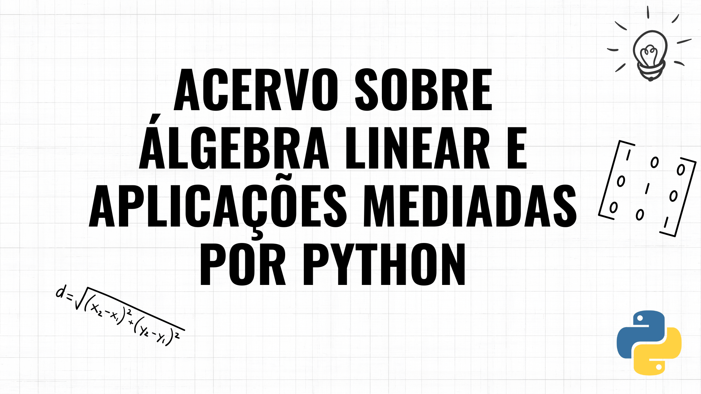

| Nome do Repositório | Autores | Descrição | Características | Grandes Áreas de Aplicação |
|---------------------|---------|-----------|-----------------|----------------------------|
| Algebra-Linear-com-Python | <a href="https://github.com/Alyssonmach"> Alysson Machado <a>|O projeto "Álgebra Linear com Python" apresenta 22 programas com textos em português que exploram aplicações computacionais de Álgebra Linear. Além das explicações , o projeto integra o uso da linguagem Python e de bibliotecas como Numpy e Matplotlib.|<ul>[Página](https://algebralinearufcg.github.io/)   <li>Conceitos e fórmulas</li><li>Códigos com documentação</li><li>Explicações em português</li> </ul>|<ul><li>Biologia</li><li>Computação</li><li>Economia</li><li>Física</li><li>Matemática</li><li>Saúde </li></ul>|
| jupyter-guide-to-linear-algebra | <a href="https://github.com/bvanderlei"> bvanderlei  <a>|O *Jupyter Guide to Linear Algebra* abrange tópicos centrais de um curso introdutório de álgebra linear, incluindo exercícios (possibilidade de usar o Live Code, para executar códigos) e várias aplicações. Também oferece uma breve introdução ao Python, focando nas partes relevantes para cálculos de álgebra linear.  |<ul> [Página](https://bvanderlei.github.io/jupyter-guide-to-linear-algebra/intro.html)    <li> Conceitos e fórmulas</li><li> Exercícios para praticar</li><li>Códigos com documentação</li> </ul> | <ul><li>Computação</li><li>Estatística</li> <li>Matemática</li><li>Saúde</li><li>Química </li> </ul>|
| Linear-Algebra-With-Python |  <a href="https://github.com/weijie-chen"> Weijie Chen <a> | Tutoriais que exploram os conceitos fundamentais de Álgebra Linear com o uso de Python, oferecendo recursos para disciplinas e aplicações que dependem de álgebra linear. | <ul> [Página](https://weijie-chen.github.io/Linear-Algebra-With-Python/)    <li>Conceitos e fórmulas</li><li> Códigos com documentação</li> </ul>|<ul><li>Estatística</li>  <li>Matemática</li></ul> |
|  intro-linear-algebra | <a href="https://github.com/pabloinsente"> Pablo Caceres <a> |A página oferece explicações de álgebra linear, utilizando python, com ênfase aplicadas ao aprendizado de máquina. Ideal como referência rápida para revisar multiplicação de matrizes, norma L2, e independência linear. É útil tanto para iniciantes que querem entender os fundamentos, quanto para quem precisa relembrar conceitos. |<ul> [Página](https://pabloinsente.github.io/intro-linear-algebra)   <li>Conceitos e fórmulas</li><li> Códigos com documentação</ul> | <ul><li>Computação</li></ul>|
| Learn Linear Algebra via Programming | <a href="https://github.com/MonitSharma"> Monit Sharma <a> |O projeto "Learn Linear Algebra via Programming" apresenta três seções principais. A primeira seção aborda os fundamentos da álgebra linear, como vetores, matrizes e transformações lineares, com exemplos e exercícios para iniciantes. A segunda seção foca em casos de uso avançados, como decomposição SVD, QR e LU, com ênfase em aplicações na computação quântica, incluindo exercícios e projetos. A terceira seção explora as aplicações da álgebra linear na computação quântica, abrangendo portas, circuitos e algoritmos quânticos, com exemplos e exercícios. |<ul> [Página]()    <li>Conceitos e fórmulas</li><li>Códigos com documentação</li></ul> | <ul><li>Computação</li><li> Estatística</li><li>Física</li> </ul>|
| MATH307 |<a href="https://github.com/patrickwalls"> Patrick Walls <a> |  A página oferece uma visão da teoria de Álgebra Linear, acompanhada de exercícios teóricos para reforçar o aprendizado. Além disso, inclui Jupyter Notebooks com exemplos de aplicações práticas de Álgebra Linear em Python.| <ul> [Página](https://ubcmath.github.io/MATH307/index.html)   <li>Códigos com documentação</li></ul> |<ul> <li>Computação</li><li> Estatística</li><li>Saúde</li> </ul>|

Este produto educacional constitui um dos resultados do projeto de pesquisa "Python, álgebra linear e suas aplicações", realizado no âmbito do PIBIC/UFAL entre setembro/2023 e agosto/2024 sob a supervisão do Prof. Dr. Marcelo Pires.
